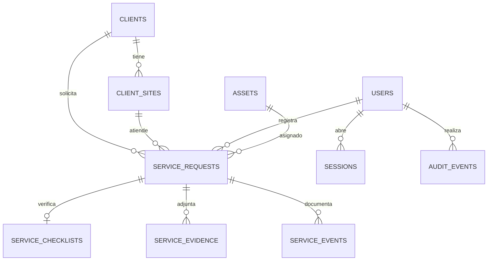

# Arquitectura y entrega del piloto RERCHAR

Documento interno de Vialoop Studio SpA. Actualizado el 25 de septiembre de 2026.

## Diagnóstico y fechas

El material recibido contiene el anexo técnico versión 3.0, el prompt maestro interno versión 2.0 y una captura de VS Code sin un proyecto abierto. No se entregaron el repositorio anterior, las planillas fuente, el contrato firmado ni credenciales de infraestructura. Por eso se creó un proyecto nuevo con datos ficticios opcionales y sin migrar información del cliente.

El prompt interno propone un piloto funcional el **25 de septiembre**. El anexo técnico sitúa la **entrega formal del piloto el lunes 28 de septiembre** y describe el contenido verificable: accesos, maestros, solicitud, planificación, checklist, evidencia y trazabilidad base. Esta versión queda lista para revisión interna del 25; la fecha y el envío contractual deben comprobarse contra el documento firmado y la Carta Gantt vigente.

## Qué funciona en este hito

| Área | Resultado verificable |
| --- | --- |
| Acceso | Inicio y cierre de sesión con opción visual para mostrar u ocultar la clave; contraseñas con scrypt; sesiones con token opaco; perfiles administrador, operaciones, conductor y cliente; bloqueos tras intentos fallidos. Administración de cuentas y empresa del portal, suspensión, reactivación, cambio de contraseña y revocación de sesiones, con auditoría sin contraseñas. |
| Maestros | Creación y corrección auditada de clientes, centros y activos desde la interfaz; módulo dedicado para administrar usuarios; vínculos cliente y centro estables al corregir sus datos visibles. |
| Solicitud | Folio secuencial único, validación, prioridad, material, rutas y cantidad estimada; clave de idempotencia que evita duplicar una solicitud reenviada. |
| Planificación | Asignación de fecha, camión, rampa opcional y conductor; aviso y bloqueo ante otra asignación del recurso en una ventana cercana. Alta de conductor desde despacho, agenda semanal, orden imprimible y cancelación motivada. |
| Terreno base | Checklist previo, impedimento de iniciar mientras haya verificaciones pendientes, comienzo de ruta, pesaje bruto y tara. |
| Evidencia | Carga privada de PDF, JPG, PNG y WebP hasta 5 MB en instalación local o 4 MB en Vercel; descarga protegida por permisos; cierre condicionado a archivo adjunto. |
| Trazabilidad | Línea de tiempo con persona y hora; auditoría en tabla separada; historial conservado tras cambios. |
| Flota y averías base | Maestro de activos, reporte y resolución de fallas; bloqueo de recursos no disponibles en nuevas planificaciones e inicio de ruta. Auditoría de los cambios. |
| Compras base | Solicitud con varios artículos, criticidad, aprobación por administrador, proveedor y referencia de orden; recepciones parciales por artículo con saldo pendiente, guía, factura opcional y estado de pago declarado. Reenvíos de una misma recepción no duplican existencias. |
| Inventario y bodegas base | Catálogo con unidades y punto de reposición, bodegas múltiples, stock físico, reservado y disponible; movimientos de Kardex por artículo y bodega, ajustes motivados, transferencias atómicas, reservas con liberación o consumo y alerta de reposición. |
| Mantenimiento y combustible | Ficha y lectura de activos, planes por fecha o lectura, órdenes preventivas/correctivas, bloqueo de disponibilidad, reserva y consumo de repuestos, costos, neumáticos y eventos; cargas de combustible con lectura y rendimiento estimado entre tanques llenos. |
| Tolvas | Ubicación única, instalación, retiro, traslado, vínculo al servicio, historial y alerta por días de permanencia. |
| Personal y acreditación | Requisitos por cliente o faena, vigencia, revisión de credencial y bloqueo del conductor sin requisito verificado en la programación y el inicio de ruta. |
| Finanzas internas | Contratos, tarifas por servicio o kg con vigencia y precedencia por faena, valorización de un folio cerrado, referencia de factura, pagos parciales, costos directos y saldo/margen calculados. Registro manual, sin emisión tributaria. |
| Ficha ambiental interna | Borrador sobre servicio cerrado, peso neto, generador, transportista, receptor, clasificación informada, revisión con evidencia, referencia manual de declaración externa, historial y CSV de trabajo. No conecta a SINADER ni SIDREP. |
| Certificado y portal cliente | Emisión administrativa después del cierre, evidencia y revisión ambiental; PDF con QR y URL de consulta pública limitada, versiones, revocación, descargas registradas y lectura de documentos propios por el cliente. La cuenta cliente se crea desde la interfaz con una empresa asignada. |
| Auditoría | Vista administrativa y CSV por periodo y entidad sobre eventos de cambios del sistema. |
| Panel y reportes | Conteos calculados desde solicitudes persistidas, indicador de averías, filtros por fecha/estado/cliente y exportación CSV respetando permisos. Identidad visual con logo sin fondo, tipografía Montserrat y señales animadas de avance. |

Las cuentas de cliente sólo consultan sus propios registros. La cuenta de conductor sólo consulta servicios que tenga asignados. Los permisos se verifican también en el servidor al procesar las acciones y al descargar archivos.

Para corregir una cuenta provisional durante una revisión local, `scripts/activar-revision.mjs` permite renombrar el administrador y fijar una clave temporal de ocho caracteres o más. El comando rechaza bases remotas y entornos de producción, revoca las sesiones anteriores y registra el cambio sin guardar la clave en la auditoría. La creación normal de usuarios mantiene un mínimo de doce caracteres.

## Arquitectura

La interfaz y el servidor usan Next.js con TypeScript estricto. Las transacciones y restricciones viven en PostgreSQL. Para que Roberto pueda abrir el piloto en su Mac sin contratar ni configurar una base externa, el entorno de desarrollo usa PGlite con archivos en `.local/`. Cuando se asigne un servidor se establecerá `DATABASE_URL` para conectarse a PostgreSQL; el modo local queda prohibido en producción. Los adjuntos locales se guardan fuera de la carpeta pública; para el piloto alojado en Vercel, `EVIDENCE_STORAGE=database` persiste archivos pequeños en PostgreSQL mediante `file_content bytea`. Ambos modos generan una clave interna aleatoria, verifican el tipo y exigen sesión y alcance para descargar. Una operación productiva con documentos numerosos o grandes requerirá almacenamiento privado dedicado y respaldo.

Claves primarias UUID para todas las entidades salvo la sesión, que usa hash del token. El folio es un identificador de negocio secuencial que no sustituye el UUID. Índices por cliente, estado, fecha, conductor y activo. Claves foráneas comprueban que el centro pertenezca al cliente. Se prevé eliminación lógica para clientes, centros, activos y solicitudes; los eventos de auditoría no se borran. Las migraciones `db/001` a `db/010` se aplican una vez sin eliminar registros previos. La migración `010` añade almacenamiento en base y conserva las referencias a archivos locales anteriores. Compras y recepciones se bloquean en transacciones para impedir excesos concurrentes; el Kardex es un registro de movimientos y los saldos se actualizan en la misma transacción. Los vínculos entre servicio, recurso, movimiento de tolva, gasto de combustible, tarifa, ficha ambiental y certificado conservan el identificador original.

## Dependencias del piloto

| Grupo | Antes de operar necesita | Estado |
| --- | --- | --- |
| 01 Acceso y permisos | Administrador inicial, usuarios y ámbitos de cliente | Implementado para piloto |
| 03 Clientes y centros | Clientes, centros vinculados | Maestro básico implementado |
| 04 Solicitudes | Usuario con acceso, cliente y centro | Implementado para piloto |
| 05 Despacho | Solicitud, camión y conductor disponibles | Planificación con rampa opcional, agenda y orden imprimible implementadas |
| 06 Terreno | Servicio programado y conductor asignado | Checklist y cierre en línea implementados; operación sin conexión pendiente |
| 07 Trazabilidad | Mutaciones y evidencias del servicio | Línea de tiempo básica implementada |
| 08 Tolvas | Cliente y faena; servicio opcional | Movimiento, estado y permanencia implementados; política real de facturación por permanencia pendiente |
| 09 y 10 Flota y averías | Activos e incidencias | Disponibilidad, fallas y bloqueo por orden de trabajo implementados; telemetría y taller externo pendientes |
| 11 y 12 Mantenimiento y combustible | Activos, lecturas, bodegas | Planes, órdenes, neumáticos, reservas y cargas implementados; consumo real por vehículo requiere lecturas validadas |
| 13 Personal | Conductores, clientes y faenas | Requisitos y vigencia enlazados a despacho; adjuntos originales y flujo con contraparte pendiente |
| 14 Solicitudes de compra | Artículos de catálogo y usuarios de operaciones | Solicitud, artículos, aprobación administrativa, orden con proveedor y seguimiento de estados implementados; cotizaciones y aprobación multinivel pendientes |
| 15 Multi-bodega y Kardex | Artículos y bodegas | Saldos, Kardex, reservas, ajustes, traslados y alertas de reposición implementados en piloto |
| 16 Recepciones | Orden aprobada y emitida | Recepción total o parcial, guía, factura opcional y pago declarado; devoluciones y conciliación financiera pendientes |
| 17 Finanzas | Servicio cerrado, contrato y tarifa | Valorización, factura manual, pagos y costos; DTE, integración bancaria y conciliación pendientes |
| 18 Registro ambiental | Servicio cerrado con pesaje y evidencia | Ficha, revisión, referencia externa manual e historial; validación regulatoria y envío oficial pendientes |
| 19 Portal del cliente | Usuario vinculado a cliente | Consulta de sus servicios, evidencias y certificados vigentes en PDF/QR; consulta pública de estado, revocación y versión. Documento y permisos finales pendientes de validación |
| 02 y 20 Panel, reportes y auditoría | Registros de los módulos anteriores | Indicadores transversales, exportación de servicios y fichas a CSV con permisos, auditoría filtrable; avisos externos e integraciones pendientes |

Estos son primeros flujos integrados de los módulos indicados, sujetos a los procesos reales que confirme RERCHAR. Compras, inventario y recepciones todavía requieren cotizaciones, aprobaciones multinivel, devoluciones y adjuntos; finanzas requiere documentos tributarios, conciliación y reglas definitivas. Mantenimiento y combustible requieren lecturas y umbrales validados. La ficha ambiental no reemplaza documentación ni declaración oficial; la obligación aplicable debe validarse con RERCHAR. El piloto **no** debe presentarse como la totalidad productiva de los veinte módulos.

Como referencia para diseñar esa integración, la [Ventanilla Única del Ministerio del Medio Ambiente](https://vu.mma.gob.cl/) identifica a SINADER como Sistema Nacional de Declaración de Residuos y a SIDREP como Sistema de Seguimiento y Declaración de Residuos Peligrosos. El CSV del piloto es una carpeta de trabajo propia; no equivale a un archivo aceptado por esos sistemas.

## Migración de las planillas

Al recibir las planillas oficiales, primero se inventariarán hojas, columnas, tipos, volúmenes y responsables de validación. Se definirá un diccionario origen-destino y un identificador canónico para clientes y activos. Fechas en texto, nombres alternativos y estados originales se conservarán junto con su interpretación. Registros sin fecha, tiempos negativos o inconsistencias se informarán como excepciones para decisión de RERCHAR, sin inventar datos.

El importador siguiente deberá poder repetir una carga sin duplicados, producir conteos y observaciones, conciliar una muestra aprobada, aplicar un corte inicial y finalmente cargar el delta acordado. Este repositorio todavía no contiene un importador porque las planillas fuente no llegaron en este encargo.

## Secuencia de trabajo posterior

| Hito | Trabajo principal | Salida que se revisa |
| --- | --- | --- |
| Piloto | Acceso, maestros, solicitud, planificación, checklist, evidencia y trazabilidad | Flujo persistente y perfiles principales; revisión interna el 25 y fecha formal del anexo el 28 de septiembre |
| Beta | Terreno sin conexión, documentos del personal, aprobaciones de compras, certificados y formatos oficiales acordados | Flujos entre áreas, reglas y conciliación de datos |
| Productiva | Veinte módulos, migración final, pruebas, respaldo, manuales y capacitación | Operación integral y aceptación con acta según Carta Gantt vigente |

El plazo contractual permite hasta 16 semanas incluidos los ciclos de revisión y corrección. Antes de prometer fechas distintas a las del contrato, se validará la Carta Gantt firmada. Las observaciones de RERCHAR corresponden a hasta diez días hábiles por hito y las correcciones de Vialoop a hasta cinco días hábiles, de acuerdo con el material entregado.

## Pruebas y controles pendientes

`npm test` verifica el flujo transaccional hasta el cierre, la visibilidad por cliente en agenda y reportes, la clave contra duplicados, los permisos del conductor, el checklist, las asignaciones de camión y rampa, las averías y el pesaje. Además comprueba compras, saldos, reservas, mantenimiento, combustible, neumáticos, tolvas, acreditación, tarifas, pagos, ficha ambiental, certificado con PDF, versiones y revocación, gestión de usuarios con límites por empresa y cierre de sesiones, corrección de maestros sin alterar los vínculos históricos, y evidencia almacenada en PostgreSQL con descarga según permisos. `npm run build` y `npm run typecheck` comprueban la aplicación. Una base temporal aplicó las migraciones y ejecutó dos veces la preparación de datos ficticios: quedó una sola tolva y un solo plan de ejemplo.

Quedan por integrar la prueba real en navegador y móvil, la recuperación autónoma de acceso, invitaciones y permisos configurables, la sincronización sin conexión, pruebas de carga, almacenamiento definitivo de adjuntos, aprobación del formato final del certificado, formatos oficiales de cumplimiento, respaldo/restauración y revisión de seguridad antes de exponer datos del cliente. El despliegue público y sus pruebas dependen de conectar una cuenta y una base PostgreSQL persistente; no se han cargado registros reales.

## Decisiones por cerrar con RERCHAR

- Confirmar anexo y Carta Gantt firmados, responsables de aprobación, casos de aceptación y momento de la entrega externa.
- Recibir planillas oficiales, fecha de corte, reglas de estados, identificadores de activos y muestra de conciliación.
- Definir usuarios reales, ámbitos de cada cuenta, política de contraseñas, perfiles de aprobación y acceso del cliente.
- Verificar si el hosting actual de 8 GB SSD soporta ejecución de Node.js, PostgreSQL, almacenamiento privado y respaldos. Si requiere infraestructura separada, cotizarla y obtener aprobación escrita antes de generar cargos.
- Confirmar identidad visual, formatos de guía y evidencia requeridos para la operación real.

## Inventario del código del piloto

`package.json`, `package-lock.json`, `tsconfig.json`, `next.config.ts`, `.env.example`, `.gitignore`, `README.md`, `docs/`, `db/`, `scripts/`, `lib/`, `app/`, `components/`, `public/rerchar-logo-transparente.png` y `tests/`. Next.js genera `next-env.d.ts` al compilar.
